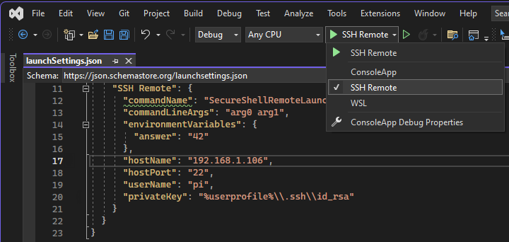
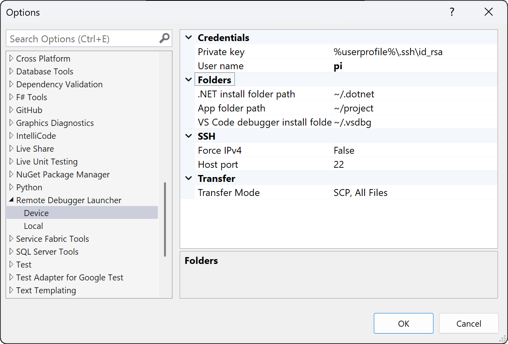
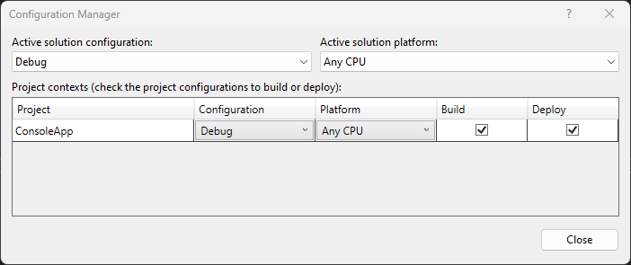

# Remote Debugger Launcher Extension
[](LICENSE)
[](README.md)
[](https://github.com/MichaelKoster70/RemoteDebuggerLaunchExtension/actions/workflows/project-release.yml)
<image align="right" width="200" height="200" src="./docs/Logo.png" />

Visual Studio 2022 Extension providing a full F5 experience for debugging .NET based applications on Linux based targets.

Visual Studio supports only 'attach to process via SSH'. This extension allows you to deploy and start .NET applications with the debugger attached via an SSH connection.

## Overview

The extension integrates with the Visual Studio 2022 .NET project system providing an additional launch profile.


The desktop side SSH support relies on the built-in [OpenSSH for Windows](https://learn.microsoft.com/en-us/windows-server/administration/openssh/openssh_overview) starting Windows 10 1809

The extension supports
- SSH authentication using private keys.
- Debugging .NET framework dependant and self contained application.
- Deploying the project output folder via SCP to the target device.
- Publish (running dotnet publish) before deploying the application.
- Installing vsdbg automatically (configurable).
- Installing .NET on the target device.
- Supporting command to setup SSH authentication.

## Getting Started

### Desktop PC prerequisites
To use this extension, you need a Windows based PC with:
- Window 10 x64 1809 or newer
- [OpenSSH for Windows](https://learn.microsoft.com/en-us/windows-server/administration/openssh/openssh_overview) client
- Visual Studio 2022 17.4 or newer with any of the .NET workloads installed like
  - .NET desktop development
  - ASP.NET and web development
  - .NET Multi-platform AppUI development


### Device prerequisites
The extension depends on the following packages.
- [.NET package dependencies](https://github.com/dotnet/core/blob/main/release-notes/7.0/linux-packages.md)
- Bash (required if the plugin shall install .NET on the device)
- OpenSSH server
- unzip
- cURL

Install the missing tools using your favorite package manager.
```
sudo apt install openssh-server unzip curl
```

### Usage
To use the plugin, follow the steps below.

#### 1. Configure Options (optional)
Open Visual Studio 2022, navigate to Tools -> Options -> Remote Debugger Launcher -> Device

Configure the default values for Credentials, Folders and SSH setting. These values will be applied if the Launch Profile does not configure them.

#### 2. Create and configure the Launch Profile
Load a Visual Studio Solution holding at least one .NET 6 based application.
Open the project 'Debug Properties' dialog. Click 'new launch profile' and select 'SSH Remote Launch'


The extension needs at the following settings to be configured either in the launch profile or the global options. The value specified in the launch profile will always override the global config.
| Value | Configuration Source |
|:----- |:-------------------- |
| Host name | Launch profile |
| User name | Launch profile, Global options |
| Private key | Launch profile, Global options |

Follow the guidelines in [SSH Key Pair](docs/SshKeyPair.md) to create the required keys for SSH authentication.

Select the newly created profile as the active launch profile.

#### 3. Configure Deploy setting
Open the solution 'Configuration Manager', Select the projects you want to build and/or deploy.


#### 4. Install .NET and the Debugger
The plugin expects .NET to be installed on the target. You can use the support commands unter Tools -> Remote Debugger Launcher to install .NET and/or the VS Code Debugger (vsdbg).


Alternativly, install
- .NET as described in [MS Learn: Install .NET on Linux](https://learn.microsoft.com/en-us/dotnet/core/install/linux)
- vsdbg as described in [Offroad Debugging of .NET Core](https://github.com/Microsoft/MIEngine/wiki/Offroad-Debugging-of-.NET-Core-on-Linux---OSX-from-Visual-Studio)

#### 5. Start Debugging session
The 'Start Debugging' (F5) will perform the following steps
1. Deploys the project ouput directory recursivly to the configured folder on the target using secure copy (SCP).
2. If configured, installs vsdbg
3. Launches the debugging session

## License
The Remote Debugger Launch Extension Visual Studio extension and associated tools are licensed under the [MIT license](LICENSE).

## How can I contribute?
We welcome contributions! 
- [Contributing](CONTRIBUTING.md) explains what kinds of contributions we welcome.

## Documentation
Additional documentation can be found in the [docs](docs/readme.md) folder.
