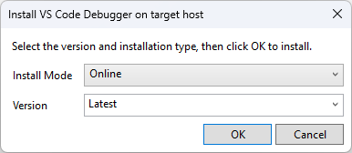
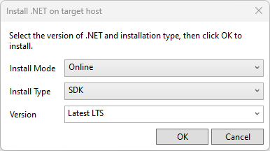
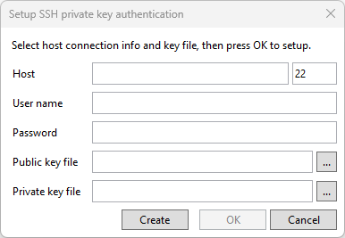
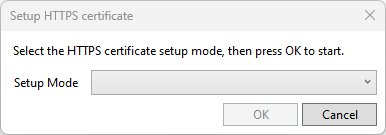

# Commands
The plugin provides a set of utility commands in the Tools menu under 'Linux Remote Debugger' menu item.
This page describes the details of each command available.

## Deploy remote target
This command allows you to deploy the build output of all projects maked as 'startup projects'.
The command uses the active launch profile to determine where the project output should be deployed to.

## Clear remote target path
This command clears the remote target path as configured in the active launch profile.

## Install VS Code remote debugger
This command tries to install vsdbg on the remote target. It uses the active launch profile to determine on which device to install vsdbg.  
 
The command has the following configuration options:
- Install Mode: how vsdbg shall be installed on the device
  - Online: Assumes the device has direct internet access. The command will exeute a shell command sequence to instruct the device to download and install vsdbg.
  - Offline: Assumes the device has *no* internet access. The command will download vsdbg locally, copy the extracted binaries (using SCP) to the device and adjust permissions where required.
- Version: lets you select the vsdbg version to install.

## Install .NET runtime
This command tries to install the .NET runtime on the target host. It uses the active launch profile to determine on which device to install .NET.  
 
The command has the following configuration options:
- Install Mode: how .NET shall be installed on the device
  - Online: Assumes the device has direct internet access. The command will exeute a shell command sequence to instruct the device to download and install .NET.
  - Offline: Assumes the device has *no* internet access. The command will download .NET locally, copy the extracted binaries (using SCP) to the device and adjust permissions where required.
- Install Type: lets you choose what to install
  - SDK: the full the .NET SDK with all runtime components
  - Runtime dotnet: the .NET runtime
  - Runtime aspnet: the ASP.NET runtime
- Version: lets you select the version to install.
  - Latest LTS: The most recent .NET LTS release
  - Latest STS: The most recent .NET STS release
  - specific .NET versions starting with .NET 6

## Setup SSH
This command tries to setup and configure SSH private key authentication on the device. It tries to add the supplied SSH public key to the 'authorized_keys' file.  
 
The command has the following configuration options:
- Host: DNS or IP of the device.
- User name: the user for which to enable SSH key auth.
- Password: the users password
- Public key file: the SSH public key to add.
- Private key file: the SSH private key to verify the success of the operation.

The 'Create' button lets you create a default SSH key pair with the following properties:
- 2048 bit RSA, PEM format, no passphrase with the name 'id_rsa'

If the key pair already exists, 'Create' uses the existing keys.

# Setup HTTPS
This command creates and installs an x.509 certificate compatible with the certificates created by 'dotnet dev-certs https' CLI command. It uses the active launch profile to determine on which device to setup the HTTPS certificate. 
 
The command has the following configuration options:
- Setup mode
  - Add or Update: Updates the existing certificate in case it is no longer valid.
  - Add or Replace: Replaces the current certificate with a new one.

The command first create a self signed CA certificate named 'Personal Developer Root' and add it as a trusted root. The cerificates intalled on the devices are signed by this CA certificate.