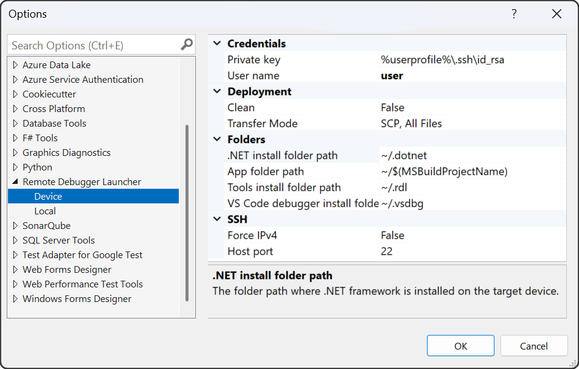
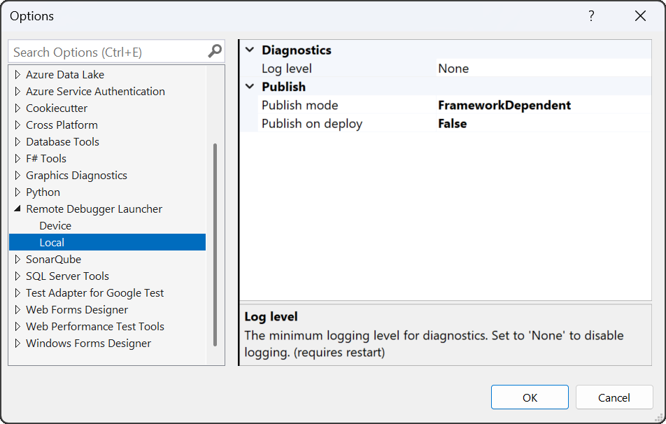

# Options
The plugin provides a set of global options in the Visual Studio under Tools -> Options -> Linux Remote Debugger.
This page describes the details of the options.

## Device options

The Device page holds all the configuration options related to device connection settings:

The values configured in this section will only be applied the launch profile has no value (launchprofile.json) does not configure it.

### Credentials
| Setting | Description |
|:------- |:-------------------- |
| Private key | The default private key to use to authenticate a SSH connection. |
| User name | The default User name. |

### Folders
| Setting | Description |
|:------- |:-------------------- |
| .NET install folder path | The default location where .NET is installed on the device. |
| App folder path | The path where the application is beeing deployed to. |
| VS Code debugger install path| The path where vsdbg is installed on the device. |

### SSH
| Setting | Description |
|:------- |:-------------------- |
| Force IPv4 | Forces the plugin to only use IPv4 addresses to communicate with the device. |
| Host port | The SSH port where the device listens for SSH connections. |

## Local options

The values configured in this section will only be applied the launch profile has no value (launchprofile.json) does not configure it.

### Credentials
| Setting | Description |
|:------- |:-------------------- |
| Publish mode | The mode (self contained vs framework dependent) how a .NET app is being published |
| Publish on deploy | The flag whether dotnet publish should be run on deploy. |

### Diagnostics
| Setting | Description |
|:------- |:-------------------- |
| Log Level | The amount of debug logging the extension should produce. 'None' disables logging. |

The log files are stored in %localappdata%\LinuxRemoteDebugger\Logfiles and are kept for 31 days.
If you change the log level after using the extension (deploy, debug, ...), please restart Visual Studio to apply the new log level.

